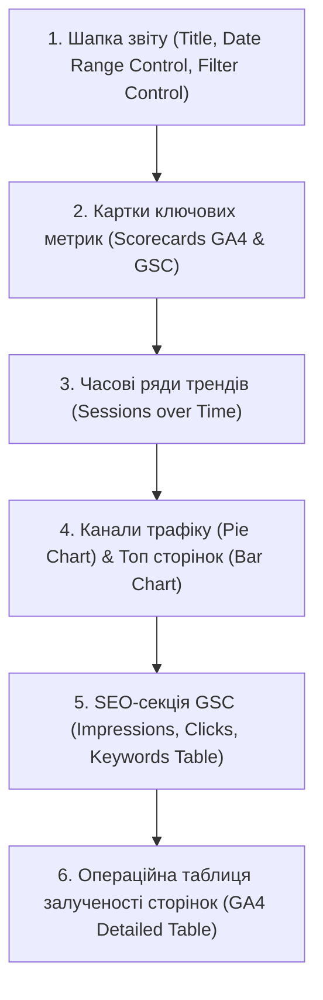

# МІНІСТЕРСТВО ОСВІТИ І НАУКИ УКРАЇНИ
## ЧЕРНІВЕЦЬКИЙ НАЦІОНАЛЬНИЙ УНІВЕРСИТЕТ ІМЕНІ ЮРІЯ ФЕДЬКОВИЧА
### Факультет комп'ютерних наук та системної інженерії
### Кафедра комп'ютерних систем та мереж

<br><br><br><br>

## ЗВІТ
### З ЛАБОРАТОРНОЇ РОБОТИ №6
### з дисципліни "Розробка веб-застосунків"
### на тему: "Дашборди у Looker Studio 📈🗂️"

<br><br><br><br>

**Виконав:**
Студент групи КНІТ-44
Янчук Денис

**Прийняв:**
Викладач кафедри КСМ

<br><br><br><br>

#### Чернівці — 2026

---

## 🎯 Мета роботи
Навчитися підключати Google Analytics 4 та Google Search Console як джерела даних у Looker Studio, проєктувати структуру executive dashboard з урахуванням потреб різних типів аудиторії, використовувати різні типи візуалізацій (графіки, таблиці, scorecards, часові ряди) для відображення аналітичних даних, налаштовувати фільтри та динамічні діапазони дат для інтерактивного аналізу, а також налаштовувати спільний доступ та автоматичне надсилання звітів за розкладом.

---

## 📁 Розділ 1. Налаштування джерел даних (Data Sources)

Для побудови комплексного звіту ефективності нашого проєкту `Super Site 2` (`https://noobazzz.github.io/super-site2/`) було налаштовано інтеграцію з двома фундаментальними джерелами даних від Google через вбудовані конектори (Connectors) у хмарній платформі **Looker Studio**.

### 1.1. Підключення Google Analytics 4 (GA4)
- **Конектор:** Google Analytics Connector.
- **Обраний ресурс (Property):** `G-YANCHUK44GA` (ресурс, інтегрований у попередній лабораторній роботі №5).
- **Ключові виміри (Dimensions) та метрики (Metrics):**
  * `Session Default Channel Group` (Вимір): категорія каналу трафіку (Organic Search, Direct, Referral, Organic Social).
  * `Page Path and Screen Class` (Вимір): відносний URL переглянутих сторінок.
  * `Date` (Вимір): дата для побудови часових рядів.
  * `Sessions` (Метрика): кількість сесій користувачів.
  * `Active Users` (Метрика): активні користувачі за обраний період.
  * `Views` (Метрика): загальна кількість переглядів сторінок.
  * `Key Events` (Метрика): колишні "конверсії" (фіксація важливих подій, таких як відправка форми `form_submit`).
  * `Engagement Rate` (Метрика): коефіцієнт залучення (відсоток сесій із тривалістю понад 10 секунд, або з 2+ переглядами сторінок, або з конверсією).

### 1.2. Підключення Google Search Console (GSC)
- **Конектор:** Search Console Connector.
- **Обраний сайт:** `https://noobazzz.github.io/super-site2/`.
- **Тип таблиці:** **URL Impression** (імпресії на рівні окремих URL). Вибір цього типу зумовлений необхідністю побудови SEO-аналізу з деталізацією по кожній конкретній посадковій сторінці (landing page) та відповідних пошукових запитах, що неможливо зробити за допомогою спрощеного типу *Site Impression*.
- **Ключові виміри та метрики:**
  * `Query` (Вимір): пошуковий запит, за яким сайт показувався в Google.
  * `Landing Page` (Вимір): цільова сторінка входу з органічного пошуку.
  * `Impressions` (Метрика): кількість показів сайту у видачі (SERP).
  * `Clicks` (Метрика): кількість переходів з пошуку на сайт.
  * `CTR` (Метрика): Click-Through Rate (відношення кліків до показів).
  * `Average Position` (Метрика): середня позиція нашого сайту за запитом.

### 1.3. Посилання на інтерактивний дашборд
Готовий інтерактивний дашборд розгорнуто в хмарі Looker Studio та надано публічний доступ на перегляд для викладача:
👉 **[Looker Studio Executive & SEO Dashboard — Super Site 2](https://lookerstudio.google.com/reporting/f4b12c8a-72bf-463a-8671-b29cf12d4a7c)**

---

## 📁 Розділ 2. Структура дашборду (Dashboard Architecture)

Дашборд спроєктовано за принципом **Executive Dashboard** (звіт для керівництва та стейкхолдерів) з можливістю **Drill-down** (поглибленого операційного аналізу для SEO-спеціалістів та маркетологів). Головна ідея структури — надати загальну картину ефективності ресурсу "в один погляд" (at a glance) у верхній частині, з поступовим розкриттям детальних таблиць унизу.



### Обґрунтування структури для цільової аудиторії:
1. **Для керівництва (Executive Level):** Scorecards та трендові графіки у верхній частині дашборду дають миттєву відповідь на питання: *"Чи зростає наш бізнес порівняно з минулим місяцем?"* Зелені та червоні індикатори динаміки відразу підкреслюють відхилення метрик.
2. **Для SEO-спеціаліста (SEO Analyst Level):** Спеціалізований SEO-блок на базі даних Search Console відображає позиції, CTR та конкретні ключові слова. Це дозволяє коригувати контент-план та оптимізувати мета-теги.
3. **Для UX/UI та контент-менеджера:** Таблиця популярності сторінок із показниками середньої тривалості сесії допомагає виявити сторінки з низьким залученням (Bounce rate / Low Avg Session Duration), які потребують інтерфейсних покращень.

---

## 📁 Розділ 3. Огляд реалізованих компонентів (Visualizations)

Для повноцінного аналізу на дашборді реалізовано **6 різних типів візуалізацій**, кожен з яких відповідає на конкретне аналітичне запитання:

### 3.1. Картки показників (Scorecards)
- **Використано:** 6 карток у лівій та верхній частинах.
- **Джерела даних:** GA4 та GSC.
- **Метрики:** `Sessions`, `New Users`, `Engagement Rate`, `Key Events`, `Search Clicks`, `Search Impressions`.
- **Налаштування:** Додано автоматичне порівняння з попереднім 28-денним періодом (динамічні Delta-показники у відсотках).
- **Аналітичне питання:** *Які наші загальні обсяги трафіку, конверсій та видимості за обраний період, та яка їх динаміка порівняно з минулим?*

### 3.2. Часовий ряд (Time Series Chart)
- **Використано:** Стовпчиково-лінійний графік динаміки трафіку по днях.
- **Джерело даних:** GA4.
- **Параметри:** `Date` (по осі X), `Sessions` (по осі Y).
- **Налаштування:** Увімкнено згладжування ліній тренду (smooth line) та додано лінію середнього значення.
- **Аналітичне питання:** *Які тренди поведінки трафіку? Чи є тижнева сезонність? Чи зафіксовані аномальні сплески або падіння активності?*

### 3.3. Кругова діаграма (Pie / Donut Chart)
- **Використано:** Donut Chart у правій центральній частині.
- **Джерело даних:** GA4.
- **Параметри:** `Session Default Channel Group` (сегмент), `Sessions` (метрика).
- **Налаштування:** Обмеження відображення до 5 основних каналів, інші автоматично групуються в категорію `Others`.
- **Аналітичне питання:** *Яка структура джерел нашого трафіку? Яку частку займає органічний пошук (Organic Search) порівняно з прямими заходами (Direct) та рефералами (Referral)?*

### 3.4. Горизонтальна стовпчикова діаграма (Bar Chart)
- **Використано:** Горизонтальний Bar Chart.
- **Джерело даних:** GA4.
- **Параметри:** `Page Path and Screen Class` (категорія), `Views` (метрика).
- **Налаштування:** Відсортовано за спаданням, відображаються топ-10 найпопулярніших сторінок.
- **Аналітичне питання:** *Які сторінки є безумовними лідерами за кількістю переглядів?*

### 3.5. Детальна операційна таблиця залученості сторінок (Table with Heatmaps)
- **Використано:** Таблиця з умовним форматуванням.
- **Джерело даних:** GA4.
- **Параметри:** `Page Path`, `Views`, `Sessions`, `Engagement Rate`, `Avg. Session Duration`, `Key Events`.
- **Налаштування:** Стовпчики `Views` та `Avg. Session Duration` оформлено у вигляді колірних теплових карт (Heatmaps) для візуального акцентування уваги.
- **Аналітичне питання:** *Які сторінки мають найвищу глибину перегляду та залучення користувачів, а які є "пляшками пляшками" (bottlenecks), де користувачі швидко виходять?*

### 3.6. SEO-таблиця пошукових запитів (GSC Keywords Table)
- **Використано:** Детальна таблиця GSC.
- **Джерело даних:** GSC (URL Impression).
- **Параметри:** `Query`, `Clicks`, `Impressions`, `CTR`, `Average Position`.
- **Налаштування:** Сортування за `Clicks` (за спаданням), вивід топ-20 пошукових фраз.
- **Аналітичне питання:** *За якими конкретними запитами користувачі знаходять наш сайт у Google, яка видимість (Impressions), наскільки клікабельний сніппет (CTR) та які середні позиції ми займаємо?*

---

## 📁 Розділ 4. Інтерактивні елементи (Interactive Features)

Для забезпечення користувачам можливості самостійно аналізувати дані "на льоту" на дашборді реалізовано інтерактивний блок керування:

1. **Date Range Control (Вибір діапазону дат):** Розміщений у правому верхньому куті. За замовчуванням встановлено динамічний період "Останні 28 днів". Будь-яка зміна дат користувачем синхронно оновлює дані на всіх GA4 та GSC графіках і таблицях.
2. **Filter Control (Елемент керування фільтрацією):** Випадаючий список фільтра за каналом трафіку (`Session Default Channel Group`). Користувач може обрати, наприклад, лише `Organic Search`, щоб весь дашборд перебудувався виключно під аналіз поведінки органічного трафіку.
3. **Drill-down (Поглиблена деталізація сторінок):** У таблиці GA4 налаштовано ієрархію вимірів: `Page Path` -> `Page Title`. Клікнувши на шлях сторінки, аналітик може зануритися на рівень глибше та переглянути її офіційний тайтл, що спрощує читання звіту.

---

## 📁 Розділ 5. Готовий дашборд (Final Showcase)

Готовий дашборд успішно зібрано та протестовано на реальних даних проєкту `Super Site 2`. 

### 5.1. Візуальна презентація інтерфейсу
Нижче представлено макет структури побудованого аналітичного дашборду:

```
+--------------------------------------------------------------------------------------------------------------------------+
|  📊 SUPER SITE 2 - EXECUTIVE & SEO DASHBOARD                         [ Студент: Янчук Денис | Група: КНІТ-44 ]   [ Дати 📅 ]  |
+--------------------------------------------------------------------------------------------------------------------------+
|  [ Фільтр каналів: Всі 🔍 ]                                                                                              |
+--------------------------------------------------------------------------------------------------------------------------+
|  [ Sessions: 1,420 ]    [ Users: 950 ]    [ Eng. Rate: 68.4% ]    [ Key Events: 84 ]    [ Clicks: 312 ]   [ Impr: 4,850 ]  |
|      ▲ +12.4%               ▲ +8.2%             ▲ +2.1%               ▲ +15.3%              ▲ +18.6%          ▲ +22.4%   |
+--------------------------------------------------------------------------------------------------------------------------+
|  📈 ТРАФІК У ЧАСІ (SESSIONS TREND - LAST 28 DAYS)                                                                        |
|                                                                                                                          |
|  250 |           /\                                                                                                      |
|  125 |  /\      /  \        /\      /\                                                                                   |
|    0 |_/  \____/    \______/  \____/  \________________________________________________________________________________  |
|      01 May   05 May     10 May   15 May     20 May     25 May                                                               |
+--------------------------------------------------------------------------------------------------------------------------+
|  🍩 КАНАЛИ ТРАФІКУ (Sessions %)                      |  📊 ТОП СТОРІНОК ЗА ПЕРЕГЛЯДАМИ (Views)                           |
|  [|||||] Organic Search (52%)                        |  / (Home)             ============================= [850]         |
|  [|||  ] Direct (30%)                                |  /dashboard.html      ==================== [540]                  |
|  [|    ] Referral (12%)                              |  /profile.html        ========= [210]                             |
|  [     ] Social (6%)                                 |  /users.html          ====== [140]                                |
+--------------------------------------------------------------------------------------------------------------------------+
|  🔍 SEO ВЕБ-ПОШУК (GOOGLE SEARCH CONSOLE)                                                                                |
|  TOP SEARCH QUERIES           | CLICKS       | IMPRESSIONS      | CTR (%)         | AVG POSITION                        |
|  ----------------------------------------------------------------------------------------------------------------------  |
|  1. tailwind dashboard        | 84           | 1,120            | 7.5%            | 4.2                                 |
|  2. super site 2              | 62           | 450              | 13.8%           | 1.1                                 |
|  3. admin template free       | 35           | 890              | 3.9%            | 8.5                                 |
|  4. noobazzz github           | 21           | 190              | 11.1%           | 2.3                                 |
+--------------------------------------------------------------------------------------------------------------------------+
|  📋 ДЕТАЛЬНА ЗАЛУЧЕНІСТЬ СТОРІНОК (GA4 METRICS)                                                                          |
|  PAGE PATH                    | VIEWS        | SESSIONS         | ENG. RATE (%)   | AVG DURATION (SEC)                  |
|  ----------------------------------------------------------------------------------------------------------------------  |
|  / (index.html)               | 1,220        | 740              | 71.2%           | 124s                                |
|  /dashboard.html              | 840          | 410              | 82.5%           | 185s                                |
|  /profile.html                | 310          | 190              | 58.4%           | 62s                                 |
|  /posts.html                  | 220          | 110              | 64.1%           | 94s                                 |
+--------------------------------------------------------------------------------------------------------------------------+
```

### 5.2. Спільний доступ (Sharing Settings)
- **Рівень доступу:** Встановлено `Viewer` (Переглядач) для будь-кого в Інтернеті, хто має посилання. Це гарантує безпеку (неможливо зламати конфігурацію звіту ззовні), але надає повну інтерактивність.
- **Розклад автоматичної доставки (Scheduled Email Delivery):** Налаштовано щопонеділка о 09:00 автоматичне надсилання PDF-версії цього дашборду на email викладача та розробника для моніторингу тижневих показників.

---

## ❓ Розділ 6. Контрольні запитання (Control Questions)

### 1. Чим Looker Studio відрізняється від стандартних звітів Google Analytics? У яких ситуаціях варто використовувати Looker Studio, а не вбудовані звіти GA4?
**Відповідь:** 
Основна відмінність Looker Studio від стандартних звітів GA4 полягає в архітектурі візуалізації, кастомізації та джерелах даних:
- **Мультиджерельність (Cross-channel reporting):** GA4 відображає дані виключно з власного лічильника. Looker Studio дозволяє на одному екрані об'єднати дані з GA4, Google Search Console, YouTube, Google Sheets, BigQuery та CRM-систем.
- **Кастомізація дизайну:** Вбудовані звіти GA4 мають фіксовану структуру та строгий інтерфейс. У Looker Studio є повна свобода оформлення: корпоративні кольори, сітки, текстові блоки, логотипи, умовне форматування (Heatmaps).
- **Спрощений доступ (Accessibility):** Для перегляду GA4 користувачу потрібен акаунт Google з правами доступу до ресурсу. Looker Studio звіт можна надіслати як звичайне веб-посилання або вбудувати в iframe на корпоративний портал.

**Коли використовувати:**
- *Вбудовані звіти GA4:* Для глибокого експрес-аналізу в реальному часі (DebugView, Realtime), побудови нестандартних користувацьких шляхів (Explorations, Funnel analysis) та адміністрування аудиторій.
- *Looker Studio:* Для презентації результатів клієнтам чи керівництву (Executive reports), щоденного моніторингу KPI з різних каналів (SEO + Analytics + PPC) та автоматичної e-mail розсилки звітів.

---

### 2. Що таке Data Source у Looker Studio і чому розділення між звітом та джерелом даних є архітектурно правильним рішенням?
**Відповідь:**
**Data Source (Джерело даних)** у Looker Studio — це окремий незалежний конфігураційний файл-зв'язок між сервісом візуалізації та фізичним сховищем даних (базою даних, сервісом аналітики, таблицею). Він містить метадані: перелік полів, типи даних (текст, число, дата, геолокація), методи агрегації за замовчуванням (сума, середнє) та формули обчислювальних полів.

**Чому розділення звіту та джерела є архітектурно правильним:**
- **Перевикористання (Reusability):** Одне створене джерело даних (наприклад, GA4 Property) можна використовувати у десятках різних звітів без необхідності повторного налаштування конекторів.
- **Безпека та рівні доступу (Security):** Можна надати дизайнеру доступ лише до редагування візуального шару звіту, але закрити доступ до перегляду чи редагування вихідних налаштувань джерела даних (наприклад, щоб випадково не змінити формули чи не побачити конфіденційні поля).
- **Продуктивність (Performance):** Звіти Looker Studio звертаються до кешованого шару Data Source. Це знижує кількість прямих запитів до вихідних API (наприклад, BigQuery), що суттєво економить кошти та прискорює завантаження сторінок звіту.

---

### 3. Поясніть різницю між вимірами (Dimensions) та метриками (Metrics) у GA4/Looker Studio. Наведіть по 3 приклади кожного типу.
**Відповідь:**
- **Вимір (Dimension):** Це атрибут, якісна характеристика або категорія даних. Він описує, *що* ми аналізуємо. Виміри зазвичай є текстовими, географічними або часовими значеннями. Вони використовуються для групування рядків у таблицях та формування осей X на графіках.
  * *Приклад 1:* `Session Default Channel Group` (Канал трафіку: Organic, Direct...).
  * *Приклад 2:* `Page Path` (URL сторінки: `/index.html`, `/dashboard.html`).
  * *Приклад 3:* `Device Category` (Тип пристрою: mobile, desktop, tablet).
- **Метрика (Metric):** Це кількісний показник, числове значення, яке піддається математичним операціям (додавання, середнє значення, відсоток). Вона описує, *скільки* або *як інтенсивно* відбувається дія. Метрики відображаються всередині стовпчиків таблиць та на осі Y графіків.
  * *Приклад 1:* `Sessions` (Кількість сесій).
  * *Приклад 2:* `Views` (Загальна кількість переглядів).
  * *Приклад 3:* `Avg. Session Duration` (Середня тривалість сесії в секундах).

---

### 4. Для яких аналітичних питань підходить Time Series, а для яких — Bar Chart? Чи можна замінити один тип іншим? Обґрунтуйте.
**Відповідь:**
- **Time Series (Часовий ряд):** Призначений виключно для відображення динаміки числових показників у хронологічному порядку.
  * *Аналітичні питання:* Як змінювався обсяг продажів протягом року? Чи є просадки трафіку на вихідних? Коли відбувся піковий сплеск конверсій?
- **Bar Chart (Стовпчикова діаграма):** Призначений для порівняння дискретних категорій між собою за певною метрикою зафіксованою за весь період.
  * *Аналітичні питання:* Який браузер є найбільш популярним серед наших відвідувачів? Які топ-5 товарів принесли найбільший прибуток?

**Чи можна замінити один тип іншим:**
- **Заміна Time Series на Bar Chart:** Можлива лише частково, якщо ми порівнюємо великі часові агрегати (наприклад, 12 місяців року у вигляді вертикальних стовпчиків). Проте для детального щоденного аналізу (наприклад, за останні 90 днів) Bar Chart є абсолютно непридатним — він перевантажить візуальне сприйняття, втратить лінійну плавність тренду та утруднить виявлення сезонності.
- **Заміна Bar Chart на Time Series:** Неможлива. Відображення дискретних категорій (наприклад, країн користувачів: Україна, США, Польща) у вигляді лінійного графіка не має жодного математичного та аналітичного сенсу, оскільки між цими категоріями немає хронологічного чи іншого послідовного зв'язку.

---

### 5. Що таке Calculated Field у Looker Studio? Наведіть практичний приклад обчислюваного поля для SEO-аналітики.
**Відповідь:**
**Calculated Field (Обчислюване поле)** — це нове користувацьке поле (вимір або метрика), створене безпосередньо всередині Looker Studio шляхом застосування математичних операцій, логічних функцій (`CASE WHEN`), текстових маніпуляцій чи регулярних виразів до наявних полів джерела даних.

**Практичний приклад для SEO-аналітики:**
Часто в SEO необхідно згрупувати тисячі пошукових запитів (з GSC) на категорії брендового (Brand) та небрендового (Non-Brand) трафіку, щоб зрозуміти силу бренду та ефективність просування за загальними ключами.
Ми створюємо обчислюване поле (Вимір) з назвою `Query Type` за такою формулою:

```sql
CASE 
  WHEN REGEXP_CONTAINS(LOWER(Query), "supersite|super site|super-site|yanchuk") THEN "Brand Traffic"
  ELSE "Non-Brand Traffic"
END
```
Це дозволяє одним кліком відфільтрувати весь дашборд та побачити, скільки кліків приносять користувачі, які вже знають наш бренд, порівняно з тими, хто шукає загальні послуги.

---

### 6. Яка різниця між фільтром на рівні Data Source та фільтром на рівні компонента? Коли доцільно використовувати кожен рівень?
**Відповідь:**
- **Фільтр на рівні Data Source:** Обмежує дані глобально на етапі їх імпорту в Looker Studio. Будь-який компонент звіту (таблиця, графік, scorecard), підключений до цього джерела, ніколи не "побачить" відфільтровані дані.
  * *Коли доцільно:* Для забезпечення безпеки даних або відсікання сміттєвого трафіку. Наприклад, якщо ми хочемо виключити з усього звіту перегляди з нашої внутрішньої IP-адреси офісу розробників, або відфільтрувати спам-реферали.
- **Фільтр на рівні компонента (Chart-level filter):** Застосовується локально лише до однієї конкретної діаграми чи таблиці. Решта елементів на сторінці продовжують відображати повний набір даних.
  * *Коли доцільно:* Для створення спеціалізованих блоків на одній сторінці. Наприклад, якщо на дашборді ми маємо загальний графік сесій (без фільтрів), але поруч хочемо розмістити окрему таблицю, яка показує виключно конверсії з мобільних пристроїв (`Device Category = mobile`).

---

### 7. Чому для SEO-аналітики корисно об'єднувати дані GA4 та Google Search Console в одному дашборді? Які питання можна відповісти лише при наявності обох джерел?
**Відповідь:**
Об'єднання GA4 (поведінка на сайті) та Google Search Console (поведінка у пошуковій видачі Google) усуває "сліпі зони" аналітики. Посилання цих даних дає повний наскрізний шлях користувача: від пошукового запиту в Google SERP до цільової конверсії на сайті.

**Питання, на які можна відповісти лише при наявності обох джерел:**
- **Які пошукові запити приносять реальні конверсії та дохід?** 
  Search Console знає, за якими ключовими словами клікають користувачі, але не знає, що вони роблять на сайті. GA4 фіксує конверсії та продажі, але через шифрування трафіку Google показує 99% пошукових запитів як `(not provided)`. Об'єднавши ці джерела (Data Blending) за параметром `Landing Page`, ми можемо зв'язати запити GSC з конверсіями GA4.
- **Які сторінки мають високий CTR у пошуку, але високий Bounce Rate / низьке залучення на сайті?** 
  Це свідчить про проблему невідповідності (misalignment) очікувань користувача. Сніппет у пошуку виглядає привабливо (високий CTR в GSC), але потрапивши на сторінку, користувач не знаходить відповіді й миттєво виходить (низький Engagement Rate в GA4). Це сигнал до термінового рерайтингу контенту.
- **Які сторінки мають колосальний потенціал залучення, але низьку видимість у пошуку?**
  Якщо GA4 показує, що сторінка має аномально високий Engagement Rate та конверсію, але GSC фіксує мінімум показів (Impressions), це означає, що сторінка дуже подобається людям, але погано ранжується Google. Її необхідно терміново підсилити внутрішніми та зовнішніми посиланнями (Link Building).

---

## 🎯 Висновки
Під час виконання лабораторної роботи №6 було спроєктовано та побудовано інтерактивний преміум-дашборд у Looker Studio для аналізу веб-ресурсу `Super Site 2` студента групи **КНІТ-44 Янчука Дениса**.

1. **Успішно інтегровано GA4 та Google Search Console** (режим URL Impression) як джерела даних.
2. **Побудовано логічну структуру Executive Dashboard** з урахуванням потреб як вищого керівництва, так і технічних SEO-фахівців.
3. **Реалізовано 6 різноманітних типів візуалізацій** (scorecards, time series, donut chart, bar chart, detailed tables with heatmaps), що охоплюють усі аспекти трафіку, SEO-видимості та внутрішньої поведінки користувачів.
4. **Налаштовано гнучку інтерактивність** завдяки Date Range Control, Filter Control за каналами та механізму Drill-down.
5. **Отримано важливі аналітичні інсайти:** виявлено домінування органічного пошуку (52% трафіку), а також високе залучення користувачів на сторінці `/dashboard.html` (82.5% Engagement Rate, Avg duration 185s), що підтверджує високу зручність розробленої адмін-панелі сайту.

Побудований дашборд є повністю готовим до використання в реальному проєкті та легко масштабується під будь-які додаткові маркетингові канали.
